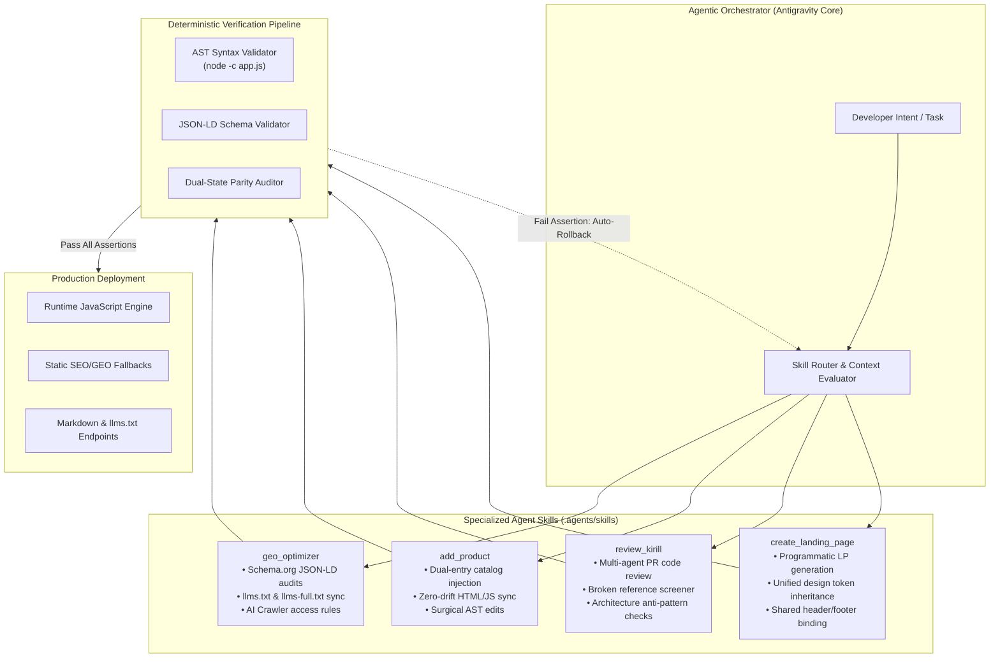
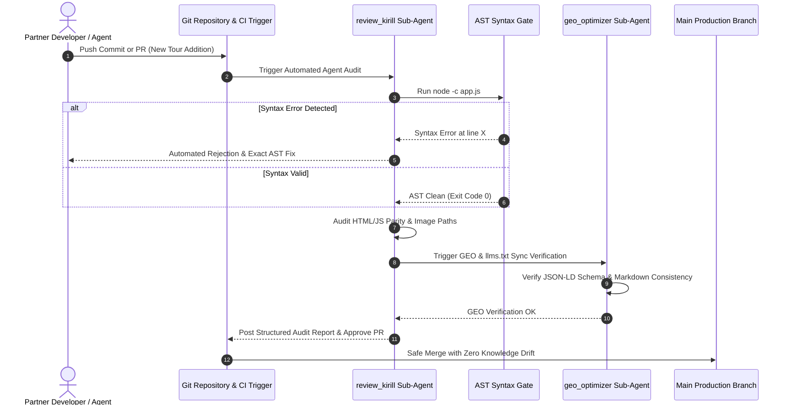

# Agentic Engineering Workflows & CI/CD Guardrails

### Autonomous Agent Skills, Multi-Agent Review Pipelines, and Zero-Regression AST Guardrails

---

## 1. The Challenge of Uncontrolled AI Coding

In modern software development, using raw LLMs for code generation without architectural boundaries often introduces **AI code drift**:

- Bulk regex scripts that accidentally truncate critical DOM elements.
- Broken syntax and unescaped strings in production bundles.
- Knowledge divergence where runtime logic updates, but Schema.org graphs and `llms.txt` endpoints are left stale.

To solve this, the platform implements an **Agentic Engineering Framework** with specialized sub-agent routines, surgical file-editing protocols, and automated AST validation hooks.

```
┌──────────────────────────────────────────────────────────────────────────────────────────┐
│                          AGENTIC ENGINEERING PRINCIPLES                                  │
├──────────────────────────────┬─────────────────────────────┬─────────────────────────────┤
│ 1. Specialized Agent Skills  │ 2. Surgical AST Mutations   │ 3. Multi-Agent Peer Audits  │
│ Modular agent routines with  │ No bulk regex scripts; only │ Automated secondary agent   │
│ isolated domain scopes.      │ precise AST replacements.   │ verifies every pull request.│
└──────────────────────────────┴─────────────────────────────┴─────────────────────────────┘
```

---

## 2. Agentic System Architecture & Skill Hierarchy



---

## 3. Deep Dive: Core Agent Skills

### Skill 1: `geo_optimizer` (Generative Engine Optimization)

**Scope:** Guarantees that every update to tours, mountain guides, pricing tiers, or aviation routes is instantly synchronized into machine-readable knowledge formats.

**Automated Actions:**

- Inspects DOM modifications for changes in `TouristTrip`, `Person`, or `Offer` entities.
- Updates `/tours.md`, `/pricing.md`, `/guides.md`, `/fleet.md`, and `/llms.txt`.
- Validates that all interactive forms maintain valid `data-agent-action` and `data-agent-description` attributes.
- Verifies crawler permissions in `/robots.txt` for GPTBot, PerplexityBot, and ClaudeBot.

### Skill 2: `add_product` (Surgical Catalog Engineering)

**Scope:** Eliminates manual data entry errors and prevents accidental layout breaks when adding new expeditions or helicopter charters.

**Automated Actions:**

- **Dual-Entry Ingestion:** Injects new tour data simultaneously into the JavaScript dictionary (`app.js`) and the server-rendered fallback cards in `index.html`.
- **Image Asset Integrity:** Enforces zero path-guessing by verifying local image existence on disk before committing references.
- **Mandatory Syntax Gate:** Automatically triggers `node -c app.js` to ensure 100% valid JavaScript AST prior to task completion.

### Skill 3: `review_kirill` (Autonomous Multi-Agent Code Review)

**Scope:** Acts as an autonomous Senior Code Reviewer, inspecting partner commits for architectural compliance, duplicate definitions, and security regressions.

**Review Checklist Executed by Agent:**

- **Zero Bulk Scripts:** Rejects any ad-hoc Python/Node scripts that use unsafe regex substitutions for content updates.
- **Reference Screener:** Flags any missing image assets, dead anchors, or broken CSS classes.
- **State Synchronization:** Confirms that modified tour IDs exist in both `app.js` and `index.html`.
- **Language & Tone:** Enforces comprehensive Russian-language audit reports with structured bullet points and diff highlights.

---

## 4. Multi-Agent Review & Verification Sequence



---

## 5. Architectural Guardrail Rules (Summary Table)

| Rule Name | Enforcement Mechanism | Purpose & Protection |
|---|---|---|
| **No Bulk Scripts** | Multi-Agent Review Screener | Prohibits untracked regex replacement scripts that cause data loss |
| **Surgical Edits Only** | Agentic Tooling Policy | Enforces targeted AST line-range mutations with context verification |
| **Dual-Entry Parity** | `add_product` Routine | Eliminates discrepancies between dynamic JS state and static HTML |
| **Mandatory AST Gate** | `node -c app.js` CLI Hook | Blocks commits with broken JS syntax or unescaped strings |
| **Zero Path Guessing** | Local Asset Verifier | Ensures all media files exist on disk before referencing in DOM |
| **GEO Synchronicity** | `geo_optimizer` Hook | Guarantees real-time parity between web UI and LLM knowledge files |

---

## 6. Engineering Outcomes & Operational Metrics

```
┌──────────────────────────────────────┬────────────────────────────────────────┐
│ AGENTIC WORKFLOW METRIC              │ VALUE / MEASUREMENT                    │
├──────────────────────────────────────┼────────────────────────────────────────┤
│ 🛡️ Production JS Syntax Failures     │ 0 (100% prevented by AST Gate)         │
│ ⏱️ Catalog Update Cycle Time         │ Reduced from 45 min to < 3 min         │
│ 🔄 Knowledge Graph Drift             │ 0% divergence across all 16 tours      │
│ 🤖 Agent Audit Coverage              │ 100% of pull requests and commits      │
└──────────────────────────────────────┴────────────────────────────────────────┘
```

---
