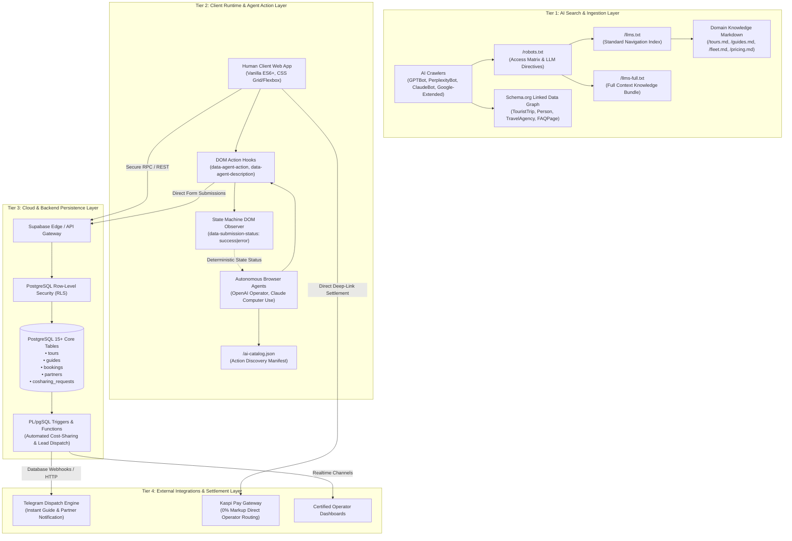
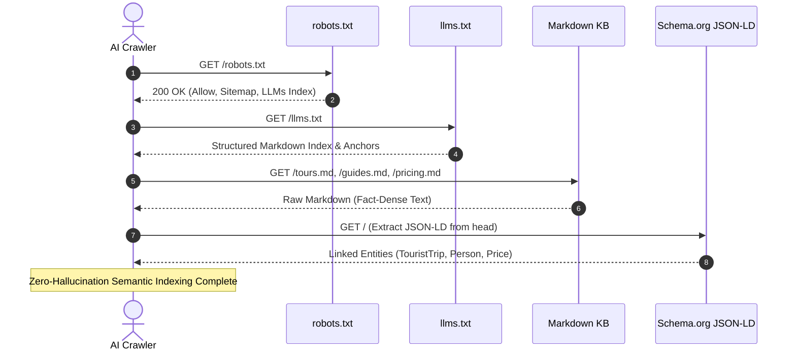
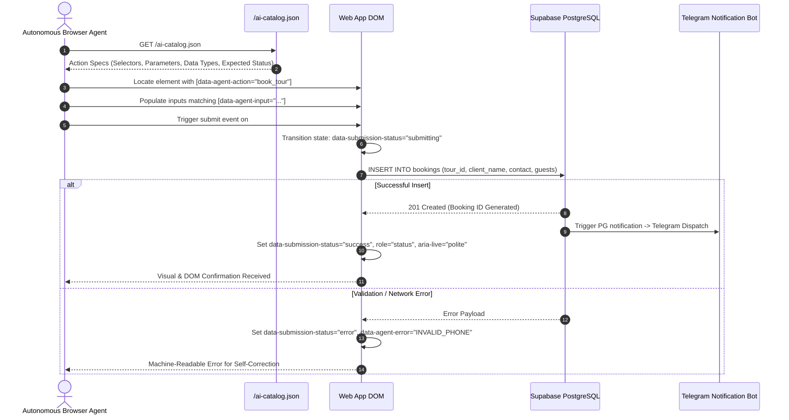

# System Architecture Deep Dive

### Dual-Layer AI-Native Web Architecture, Agentic Protocols, and Event-Driven Pipelines

---

## 1. Architectural Philosophy & Principles

Traditional web applications are built exclusively for human optical rendering through web browsers. In the era of Generative AI and Autonomous Agentic Browsing (Perplexity, OpenAI Operator, Claude Computer Use, Google Gemini), web systems must operate with **dual-layer native capability**:

1. **Human-Centric Experience:** Ultra-fast, responsive, aesthetically engaging client runtime with sub-50ms First Contentful Paint (FCP) and zero framework bloat.
2. **Machine-Centric Execution Layer:** Deterministic, self-describing, and structured knowledge endpoints (`llms.txt`, JSON-LD graphs, `ai-catalog.json`) paired with semantic DOM action hooks (`data-agent-*`) that allow AI agents to navigate, reason, and execute transactions without hallucination.

```
┌──────────────────────────────────────────────────────────────────────────────────────────┐
│                            DUAL-LAYER CORE PRINCIPLES                                    │
├──────────────────────────────┬─────────────────────────────┬─────────────────────────────┤
│ 1. Zero Knowledge Drift      │ 2. Deterministic Execution  │ 3. Event-Driven Decoupling  │
│ Synchronous parity between   │ Machine-readable DOM hooks  │ Database triggers handle    │
│ dynamic JS runtime & static  │ and strict state-machine    │ notification routing and    │
│ AI-crawler endpoints.        │ feedback loops for agents.  │ business logic asynchronously│
└──────────────────────────────┴─────────────────────────────┴─────────────────────────────┘
```

---

## 2. Multi-Tier End-to-End System Architecture



---

## 3. Data Flow & Interaction Sequences

### Flow A: AI Search Engine Ingestion (GEO Pipeline)

This sequence guarantees that LLM-powered search engines ingest 100% verified facts (prices, certifications, itineraries) without relying on fragile heuristic scrapers.



### Flow B: Autonomous Agent Web Action Execution

When an autonomous browser agent (e.g., OpenAI Operator) performs a booking on behalf of a traveler, it follows this deterministic action protocol:



---

## 4. Frontend Architecture & Zero-Drift Synchronization

To eliminate the common flaw where single-page apps render empty shells for non-JavaScript crawlers, the platform implements a **Zero-Drift Dual-Storage Architecture**:

```
                              ┌─────────────────────────────┐
                              │     Central Source of       │
                              │        Truth Data           │
                              └──────────────┬──────────────┘
                                             │
                     ┌───────────────────────┴───────────────────────┐
                     ▼                                               ▼
      ┌─────────────────────────────┐                 ┌─────────────────────────────┐
      │   JavaScript Dynamic Map    │                 │   Static HTML Fallbacks &   │
      │         (app.js)            │                 │   Schema.org JSON-LD        │
      ├─────────────────────────────┤                 ├─────────────────────────────┤
      │ • Client-side filtering     │                 │ • Static SEO crawlers       │
      │ • Modal hydration           │                 │ • Accessibility screeners   │
      │ • Reactive price updates    │                 │ • LLM DOM scrapers          │
      └─────────────────────────────┘                 └─────────────────────────────┘
                     ▲                                               ▲
                     └───────────────────────┬───────────────────────┘
                                             │ Verified by
                              ┌──────────────┴──────────────┐
                              │  Agentic CI/CD Guardrails   │
                              │  (Zero-Drift Lint Audits)   │
                              └─────────────────────────────┘
```

**Key Technical Decisions:**

- **No Heavy Framework Overhead:** Built in vanilla ES6+ with native Web APIs (`IntersectionObserver`, `CustomEvent`, CSS Variables) ensuring instantaneous loading on mobile connections in mountain basecamps.
- **Synchronous Content Updates:** Any modification to tour parameters (itineraries, base prices, elevation) is synchronously reflected across both dynamic JavaScript maps and static HTML nodes, preventing hydration mismatches.

---

## 5. Web Actions Protocol Specification

The platform standardizes Web Actions to make the DOM self-describing for vision and DOM-based AI agents.

**Core DOM Attributes:**

| Attribute | Purpose | Example Value |
|---|---|---|
| `data-agent-action` | Identifies the business capability of a form or button | `book_tour`, `order_transfer`, `filter_difficulty` |
| `data-agent-description` | Natural language instructions for LLM planning | `Submits booking directly to certified guide with 0% markup` |
| `data-agent-input` | Explicit semantic tag for form inputs | `client_name`, `contact_info`, `guests_count` |
| `data-submission-status` | Deterministic state machine indicator | `idle`, `submitting`, `success`, `error` |
| `data-agent-error` | Machine-readable error code for agent retry logic | `INVALID_CONTACT`, `CAPACITY_EXCEEDED` |

---

## 6. Event-Driven Backend & Database Architecture

The backend infrastructure utilizes Supabase (PostgreSQL 15+) configured with automated triggers and event streams:

```
[ Client Form Submission ]
            │
            ▼
[ PostgreSQL Table: public.bookings ] ──► (Row-Level Security Enforcement)
            │
            ▼ (AFTER INSERT Trigger)
[ PL/pgSQL Function: notify_new_booking() ]
            │
            ▼
[ pg_net HTTP Post / Database Webhook ]
            │
            ▼
[ Telegram Dispatcher Bot / Partner SMS Queue ]
```

**Highlights:**

- **Asynchronous Notification Routing:** Eliminates API latency on the frontend by offloading partner dispatching to native PostgreSQL triggers.
- **Co-Sharing Cost Splitting:** Triggers on `cosharing_requests` automatically recompute per-person prices dynamically when new participants join an open expedition slot.
- **Strict Data Isolation:** Row-Level Security (RLS) ensures partners and guides only access bookings assigned to their certified organization ID.

---

## 7. Reliability, Scalability & Failure Modes

```
┌───────────────────────────┬───────────────────────────┬───────────────────────────┐
│ FAILURE MODE              │ IMPACT                    │ MITIGATION STRATEGY       │
├───────────────────────────┼───────────────────────────┼───────────────────────────┤
│ AI Crawler Rate Limit     │ Slowed search ingestion   │ Edge-cached static .md    │
│                           │                           │ and llms.txt at CDN edge  │
├───────────────────────────┼───────────────────────────┼───────────────────────────┤
│ Database Connection Spike │ Delayed booking write     │ Fallback localStorage     │
│                           │                           │ queue + background retry  │
├───────────────────────────┼───────────────────────────┼───────────────────────────┤
│ Kaspi Gateway Downtime    │ Inability to pay online   │ Direct guide invoice      │
│                           │                           │ dispatch via Telegram     │
└───────────────────────────┴───────────────────────────┴───────────────────────────┘
```

---
