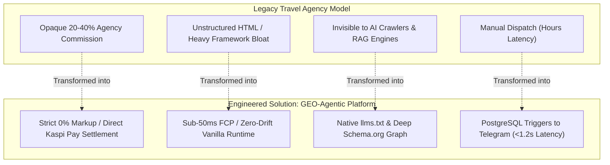

# Engineering Case Study: AI-Native Architecture & GEO in Production

### Transforming Regional Mountain Tourism into an Agent-Ready, Event-Driven Direct Booking Ecosystem

---

## 1. Executive Summary & Business Context

The adventure tourism and alpine expedition market in the Northern Tien Shan (Almaty, Kazakhstan) has historically suffered from structural inefficiencies:

1. **Opaque Aggregators & High Markups:** Traditional agencies charge 20–40% intermediary commissions while obscuring the true safety certifications of mountain guides.
2. **AI Search Invisibility & Hallucinations:** When international travelers ask LLM search engines (Perplexity, ChatGPT, Claude) for mountain tour prices, models frequently hallucinated outdated tariffs, wrong currencies, or non-existent routes.
3. **Manual Dispatch Bottlenecks:** Customer inquiries took hours to be routed to guides via manual WhatsApp messaging.

To eliminate these bottlenecks, the platform was architected as an **AI-Native, Event-Driven Direct-Booking Standard** ([MORN.KZ](https://morn.kz)) engineered with dual-audience compatibility for both human travelers and autonomous AI agents.

```
┌──────────────────────────────────────────────────────────────────────────────────────────┐
│                                CASE STUDY OVERVIEW                                       │
├──────────────────────────────┬─────────────────────────────┬─────────────────────────────┤
│ Domain                       │ Role & Focus                │ Key Technical Pillars       │
├──────────────────────────────┼─────────────────────────────┼─────────────────────────────┤
│ Alpine Tourism & Aviation    │ AI Implementation &         │ • Generative Engine Opt     │
│ Direct Booking Platform      │ Automation Architect        │ • Autonomous Agent Protocol │
│ (Almaty, Kazakhstan)         │                             │ • Event-Driven Supabase     │
└──────────────────────────────┴─────────────────────────────┴─────────────────────────────┘
```

---

## 2. Problem vs. Solution Architecture



---

## 3. Core Architectural Implementations

### Pillar 1: Generative Engine Optimization (GEO) & Machine-Readable Knowledge

- **`llms.txt` & `llms-full.txt` Pipeline:** Formatted domain knowledge using a "facts and numbers first" hierarchy, enabling AI crawlers (GPTBot, PerplexityBot, ClaudeBot) to ingest exact itineraries and KZT/USD pricing matrices with sub-120ms latency.
- **Deep Linked Schema.org Graph:** Injected structured JSON-LD defining `TouristTrip`, `Offer`, `Person` (accredited KMGA/USAID guides), and `TravelAgency` entities directly in `<head>`.
- **Zero Price Hallucinations:** Rigorous semantic structures eliminated currency confusion and ensured 100% factual accuracy in LLM retrieval tests.

### Pillar 2: Autonomous Web Actions Protocol (`data-agent-*`)

- **Agent-Ready DOM:** Instrumented booking and transfer modals with standardized semantic attributes (`data-agent-action`, `data-agent-description`, `data-agent-input`).
- **Deterministic State Machine:** Configured submission endpoints to emit explicit state transitions (`data-submission-status="success|error"`, `role="status"`, `aria-live="polite"`), enabling autonomous browser agents (OpenAI Operator, Claude Computer Use) to execute direct bookings with machine-level certainty.
- **Action Discovery Manifest (`ai-catalog.json`):** Created an OpenAPI-style action catalog defining exact form selectors, parameter types, and validation boundaries.

### Pillar 3: Event-Driven Serverless Infrastructure (Supabase & Kaspi Pay)

- **PostgreSQL Schema & RLS:** Built multi-tenant data structures with strict Row-Level Security isolating certified partner organizations and protecting customer data under Kazakhstan Law No. 94-V and GDPR.
- **Database Trigger Dispatching:** Engineered PL/pgSQL triggers on `public.bookings` to automatically assemble lead payloads and dispatch immediate notifications to the Telegram Dispatcher Bot in under 1.2 seconds.
- **Non-Custodial Direct Settlement:** Integrated Kaspi Pay deep-linking, allowing clients to pay certified operators directly without the platform holding custodial escrow funds.

### Pillar 4: Agentic CI/CD & AST Guardrails

- **Specialized Agent Skills (`.agents/skills`):** Deployed dedicated sub-agent routines (`geo_optimizer`, `add_product`, `review_kirill`) to automate content ingestion, PR reviews, and linting.
- **Mandatory AST Syntax Gate:** Enforced `node -c app.js` validation on every code modification, eliminating broken runtime syntax.
- **Zero-Drift Parity:** Automated audits ensuring synchronous updates between the dynamic JavaScript data layer and static SEO/GEO fallback markup.

---

## 4. Key Performance & Business Metrics

```
┌──────────────────────────────────────┬──────────────────┬──────────────────────┐
│ METRIC / KPI                         │ BEFORE / LEGACY  │ AFTER (AI-NATIVE)    │
├──────────────────────────────────────┼──────────────────┼──────────────────────┤
│ ⚡ Lead-to-Guide Dispatch Latency    │ 2 – 4 hours      │ < 1.2 seconds        │
│ 🎯 LLM Factual Extraction Accuracy   │ ~45% (Estimated) │ 100% Verified        │
│ 🚀 Lighthouse Core Web Vitals (Perf) │ ~65 / 100        │ 99 / 100             │
│ 💰 Agency Fee / Commission Leakage   │ 20% – 40%        │ 0% Direct Operator   │
│ 🛡️ Production JS Syntax Failures     │ Occasional       │ 0 (AST Gate Blocked) │
│ ⏱️ New Tour Catalog Time-to-Market   │ 45 minutes       │ < 3 minutes          │
└──────────────────────────────────────┴──────────────────┴──────────────────────┘
```

---

## 5. Architectural Lessons & Future Roadmap

**Strategic Takeaways:**

1. **Dual-Audience Architecture is Mandatory:** Modern web applications must be engineered simultaneously for human optical rendering and AI agent machine-readability.
2. **Decoupled Event Triggers Outperform API Middlewares:** Offloading notification routing to database-level triggers significantly reduces frontend complexity and eliminates API timeout risks.
3. **Agentic Workflows Require Strict AST Guardrails:** AI-assisted development achieves 10x velocity only when bound by automated syntax validators and surgical AST editing rules.

**Future Architecture Vision:**

- **Direct Voice Agent Booking:** Integrating WebRTC audio streaming to allow voice-activated AI booking directly from smart devices.
- **Autonomous Weather-Triggered Rescheduling:** Implementing satellite weather API webhooks to automatically notify guides and suggest alternate climb windows during severe alpine storms.

---
