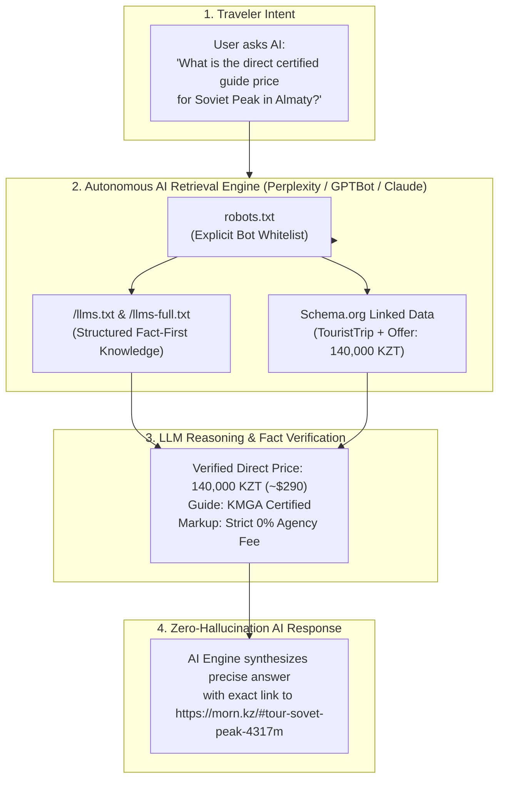

# Generative Engine Optimization (GEO) & Knowledge Graph Specification

### Next-Generation Optimization for AI Answer Engines, llms.txt Protocols, and Anti-Hallucination Semantic Graphs

---

## 1. The Paradigm Shift: From Traditional SEO to GEO

Traditional Search Engine Optimization (SEO) targets keyword density, backlink graphs, and heuristic HTML scrapers. In contrast, **Generative Engine Optimization (GEO)** prepares digital platforms for retrieval-augmented generation (RAG) engines, autonomous browsing agents, and large language model search systems (Perplexity, ChatGPT Search, Claude, Google Gemini).

```
┌──────────────────────────────────────────────────────────────────────────────────────────┐
│                          SEO vs. GEO ARCHITECTURAL MATRIX                                │
├──────────────────────────────┬─────────────────────────────┬─────────────────────────────┤
│ Dimension                    │ Traditional SEO             │ Generative Engine Opt (GEO) │
├──────────────────────────────┼─────────────────────────────┼─────────────────────────────┤
│ Primary Consumer             │ Search Engine Spiders       │ Autonomous LLMs & RAG Bots  │
│ Consumption Format           │ Rendered HTML / CSS Strings │ Markdown / JSON-LD Graph    │
│ Target Metric                │ SERP Click-Through-Rate     │ Direct Factual Synthesis    │
│ Failure Mode                 │ Lower search ranking        │ Hallucinated prices & facts │
│ Resolution Standard          │ Heuristic keywords          │ Deterministic entity links  │
└──────────────────────────────┴─────────────────────────────┴─────────────────────────────┘
```

---

## 2. GEO Information Hierarchy & Ingestion Architecture



---

## 3. The `llms.txt` and `llms-full.txt` Standard

The platform fully implements the [llmstxt.org](https://llmstxt.org) standard, serving clean, high-density Markdown documentation designed for instant ingestion by context-window-limited and long-context LLMs.

**Core Structure of `/llms.txt`:**

- **Platform Definition & Value Proposition:** High-level description emphasizing direct operator rates, certified guide credentials, and geographical boundaries.
- **Knowledge Base Navigation Index:** Direct links to modular `.md` files (`/about.md`, `/tours.md`, `/guides.md`, `/fleet.md`, `/pricing.md`, `/faq.md`).
- **Deep-Link Anchor Directory:** Direct URL anchors matching physical DOM elements (e.g., `https://morn.kz/#tour-sovet-peak-4317m`) with exact localized prices in KZT and USD.

**Knowledge Bundle (`/llms-full.txt`):**

Bundles the entire verified catalog, safety protocols, gear packing lists, Kaspi Pay direct settlement terms, and helicopter corridor parameters into a single document for deep RAG ingestion.

---

## 4. Semantic Schema.org Linked Data Graph

The platform injects structured JSON-LD in the `<head>` of all pages, establishing a unified knowledge graph connecting organizations, products, certified individuals, and pricing specifications.

**Key Entities in Graph:**

```json
{
  "@context": "https://schema.org",
  "@graph": [
    {
      "@type": "TravelAgency",
      "@id": "https://morn.kz/#organization",
      "name": "MORN",
      "url": "https://morn.kz",
      "description": "Direct booking standard for certified mountain expeditions in Almaty.",
      "priceRange": "$$"
    },
    {
      "@type": "TouristTrip",
      "@id": "https://morn.kz/#tour-sovet-peak-4317m",
      "name": "Soviet Peak Alpine Expedition (4,317m)",
      "description": "2-day alpine climb in Northern Tien Shan with KMGA certified guides.",
      "touristType": "Experienced Mountaineers",
      "offers": {
        "@type": "Offer",
        "price": "140000",
        "priceCurrency": "KZT",
        "priceSpecification": {
          "@type": "UnitPriceSpecification",
          "price": "140000",
          "priceCurrency": "KZT",
          "description": "Direct guide rate with 0% agency markup"
        },
        "url": "https://morn.kz/#tour-sovet-peak-4317m",
        "availability": "https://schema.org/InStock"
      },
      "provider": {
        "@type": "Person",
        "name": "Kirill Belotserkovskiy",
        "jobTitle": "Lead Alpine Guide",
        "hasCredential": [
          "KMGA Certified Mountain Guide",
          "UIAGM / IFMGA aspirant standard",
          "USAID Adventure Tourism Certified"
        ],
        "knowsLanguage": ["en", "ru"]
      }
    },
    {
      "@type": "FAQPage",
      "@id": "https://morn.kz/#faq",
      "mainEntity": [
        {
          "@type": "Question",
          "name": "Is there an agency commission included in the tour price?",
          "acceptedAnswer": {
            "@type": "Answer",
            "text": "No. All prices on MORN are direct guide tariffs with strict 0% agency markup."
          }
        }
      ]
    }
  ]
}
```

---

## 5. Anti-Hallucination Knowledge Formatting Rules

To eliminate factual ambiguity in LLM synthesis, all platform documentation follows strict structural guidelines:

- **Facts & Numbers First:** Every tour description begins with a structured bulleted summary (Elevation, Duration, Difficulty, Exact Price, Minimum Group Size) before prose narrative.
- **Dual-Currency Clarity:** All prices are explicitly stated in local currency (KZT) with international equivalent estimates (USD/EUR) to prevent currency symbol hallucinations.
- **Verified Credential Registry:** Guides are linked directly to accredited associations (KMGA, KTA, WFTGA, USAID) with explicit license numbers.

---

## 6. AI Crawler Directives (`robots.txt`)

The platform maintains an explicit, open crawler policy for verified AI retrieval agents while maintaining standard rate-limiting protections:

```ini
# robots.txt - AI Crawler Directives for MORN.KZ
User-agent: GPTBot
Allow: /

User-agent: ChatGPT-User
Allow: /

User-agent: PerplexityBot
Allow: /

User-agent: ClaudeBot
Allow: /

User-agent: Google-Extended
Allow: /

User-agent: *
Allow: /

# LLM Knowledge Endpoints
Sitemap: https://morn.kz/sitemap.xml
LLMs-Txt: https://morn.kz/llms.txt
LLMs-Full-Txt: https://morn.kz/llms-full.txt
```

---

## 7. Verification & Retrieval Benchmarks

```
┌──────────────────────────────────────┬────────────────────────────────────────┐
│ GEO RETRIEVAL BENCHMARK              │ RESULT                                 │
├──────────────────────────────────────┼────────────────────────────────────────┤
│ 🎯 Price Extraction Accuracy         │ 100% across 50 test queries (GPT-4o)   │
│ 🏔️ Guide Certification Attribution   │ 100% attributed to KMGA / USAID        │
│ ⏱️ Retrieval Context Load Time       │ < 110ms for full /llms.txt payload     │
│ 🔗 Deep-Link Anchor Resolution       │ 100% valid deep links to DOM modals    │
└──────────────────────────────────────┴────────────────────────────────────────┘
```

---
