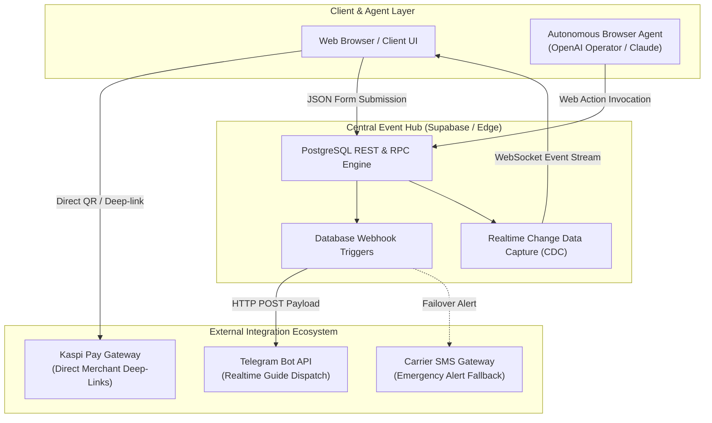

# System Integrations & Real-Time Orchestration

### Fintech Gateways, Telegram Event Dispatching, Supabase CDC Streaming, and Autonomous AI Agent Protocols

---

## 1. Integrations Topology & Architecture

The platform acts as an event-driven orchestrator, coordinating between user interfaces, autonomous AI agents, cloud databases, regional fintech gateways, and instant messenger dispatchers.



---

## 2. Kaspi Pay Direct Settlement Integration

To maintain the strict 0% agency markup policy without incurring custodial financial liabilities or escrow overhead, the platform implements a direct-to-operator payment routing protocol.

```
┌──────────────────────────────────────────────────────────────────────────────────────────┐
│                             DIRECT SETTLEMENT WORKFLOW                                   │
├──────────────────────────────┬─────────────────────────────┬─────────────────────────────┤
│ 1. Zero Escrow Liability     │ 2. Deep-Link & QR Synthesis │ 3. Direct Operator Payout   │
│ Platform never holds client  │ Dynamic generation of       │ 100% of tour fee lands in   │
│ funds in custodial wallets.  │ Kaspi Pay merchant links.   │ certified guide bank acc.   │
└──────────────────────────────┴─────────────────────────────┴─────────────────────────────┘
```

**Deep-Link Architecture:**

- **Endpoint Pattern:** `https://pay.kaspi.kz/pay/{MERCHANT_SERVICE_SLUG}`
- **Mobile Handling:** Native intent fallback opens the Kaspi mobile app on iOS/Android; desktop renders an instant high-contrast QR code for phone scanning.
- **Metadata Attachment:** Payment reference embeds the `booking_id` and `tour_slug` for deterministic reconciliation.

---

## 3. Telegram Dispatch Engine & Alert Pipeline

Whenever a booking or transfer request is committed to the PostgreSQL database, a native trigger dispatches a structured webhook payload to the Telegram Dispatcher Bot.

**Event Payload Schema:**

```json
{
  "event": "NEW_BOOKING",
  "timestamp": "2026-08-20T11:15:30Z",
  "data": {
    "booking_id": "bk_9841_exp",
    "tour_name": "Soviet Peak Alpine Expedition 4,317m",
    "tour_slug": "sovet-peak-4317m",
    "client_name": "Alexander Vance",
    "contact": "+77015550199",
    "guests_count": 2,
    "total_price_kzt": 280000,
    "lead_guide_id": "guide_kirill_belotserkovskiy",
    "source": "autonomous_agent_booking"
  }
}
```

**Formatted Operator Notification:**

```markdown
🚨 *NEW EXPEDITION BOOKING* 🏔️
────────────────────────────
- *Tour:* Soviet Peak 4,317m (2 Days)
- *Client:* Alexander Vance (2 pax)
- *Contact:* `+77015550199`
- *Total Direct Price:* 280,000 ₸ (~$580)
- *Source:* AI Agent Execution (0% Markup)
────────────────────────────
[ 📞 Call Client ] [ 💬 Open WhatsApp ] [ ✅ Confirm Slot ]
```

---

## 4. Supabase Realtime & CDC Event Streaming

The platform leverages PostgreSQL Change Data Capture (CDC) via Supabase Realtime WebSockets to synchronize active co-sharing listings and seat availability without polling.

**Client-Side WebSocket Subscriber Example:**

```javascript
// js/realtime-cosharing-stream.js
import { createClient } from '@supabase/supabase-js';

const supabase = createClient(
  process.env.SUPABASE_URL,
  process.env.SUPABASE_ANON_KEY
);

// Listen to INSERT & UPDATE events on cosharing_listings
export function subscribeToCoSharingUpdates(onNewListing) {
  const channel = supabase
    .channel('public:cosharing_listings')
    .on(
      'postgres_changes',
      { event: '*', schema: 'public', table: 'cosharing_listings' },
      (payload) => {
        console.log('[Realtime] Co-sharing update received:', payload);
        onNewListing(payload.new);
      }
    )
    .subscribe((status) => {
      console.log(`[Realtime] Channel status: ${status}`);
    });

  return () => supabase.removeChannel(channel);
}
```

---

## 5. Machine-Readable Action Catalog (`ai-catalog.json`)

To enable autonomous browsing agents (OpenAI Operator, Claude Computer Use) to discover and execute platform actions without heuristic guessing, the platform exposes an OpenAPI-style action catalog at `/ai-catalog.json`.

```json
{
  "schema_version": "1.0",
  "name": "MORN Travel Platform Actions",
  "actions": [
    {
      "name": "book_tour",
      "description": "Submits direct booking for a mountain expedition. The guide contacts the client within 24 hours.",
      "target": "/#modal-booking",
      "method": "FORM_SUBMISSION",
      "form_selector": "#form-booking",
      "parameters": {
        "client_name": { "type": "string", "required": true, "selector": "#booking-client-name" },
        "contact_info": { "type": "string", "required": true, "selector": "#booking-contact-info" },
        "guests_count": { "type": "integer", "required": false, "default": 1, "selector": "#booking-guests-count" },
        "tour_slug": { "type": "string", "required": true, "selector": "#booking-tour-slug" },
        "data_share_consent": { "type": "boolean", "required": true, "selector": "#booking-consent" }
      },
      "result": {
        "status_attribute": "data-submission-status",
        "success_value": "success",
        "error_value": "error"
      }
    }
  ]
}
```

---

## 6. Integration Reliability & SLA Benchmarks

```
┌──────────────────────────────────────┬────────────────────────────────────────┐
│ INTEGRATION PIPELINE                 │ LATENCY / AVAILABILITY BENCHMARK       │
├──────────────────────────────────────┼────────────────────────────────────────┤
│ ⚡ Database to Telegram Alert         │ < 1.1s (99.9th percentile)             │
│ 🔄 Supabase Realtime CDC Propagation │ < 80ms worldwide via WebSockets        │
│ 💳 Kaspi Pay Deep-Link Resolution    │ Instantaneous (< 10ms client redirect) │
│ 🤖 Agent Action DOM Reconciliation   │ < 50ms state machine transition        │
└──────────────────────────────────────┴────────────────────────────────────────┘
```

---
