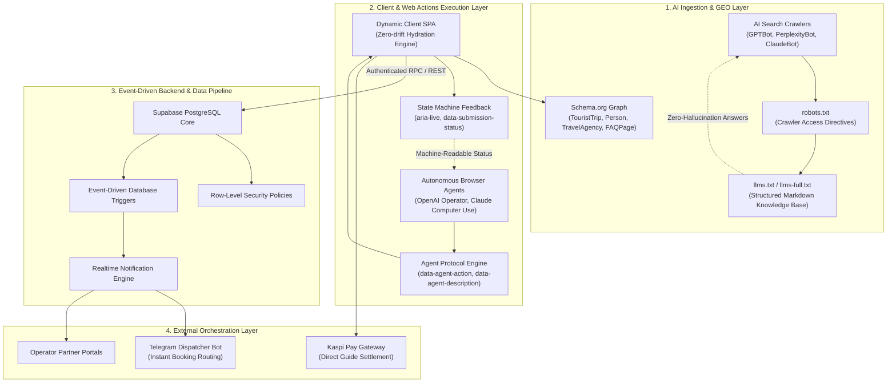
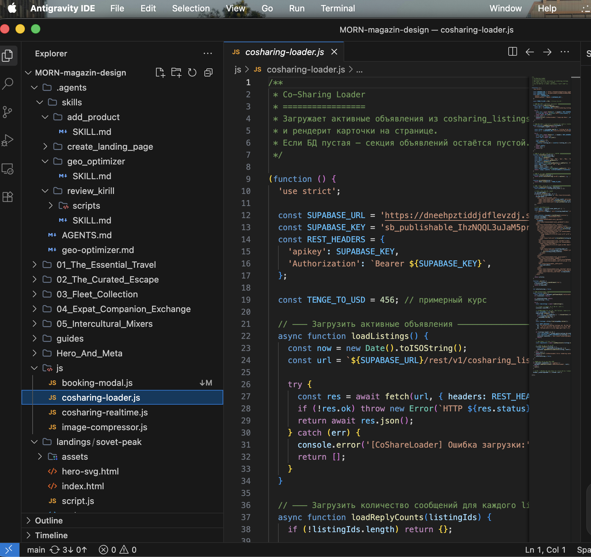
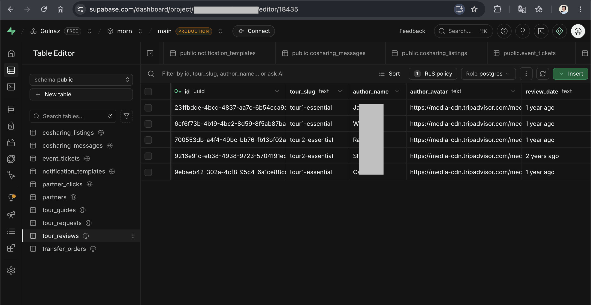
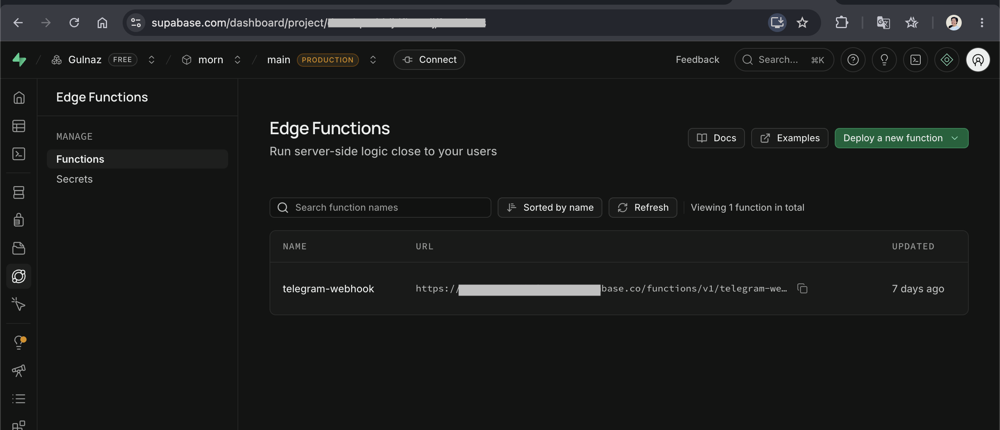
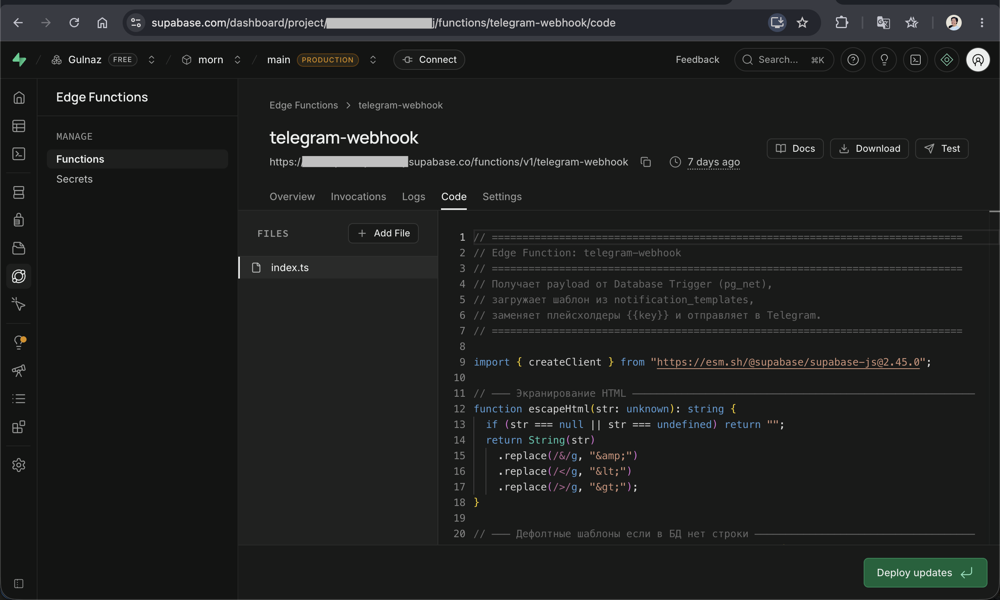
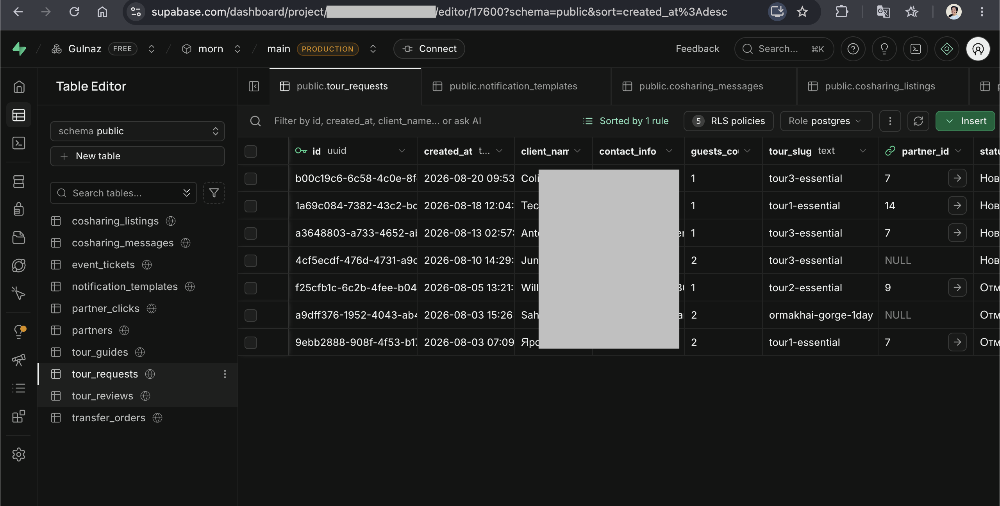

# GEO-Agentic Travel Automation Platform
### Next-Gen AI-Native Architecture: Generative Engine Optimization (GEO), Autonomous Agent Protocols, and Event-Driven Cloud Pipelines

*🇷🇺 [Русская версия](README.ru.md)*

---

## Executive Summary

The **GEO-Agentic Travel Automation Platform** (engineered for the [MORN.KZ](https://morn.kz) ecosystem) is a production-grade blueprint that demonstrates how modern web applications can achieve dual-layer native compatibility: serving human travelers with ultra-fast, premium user experiences while functioning as a **machine-readable knowledge graph and execution environment for autonomous AI agents** (such as Perplexity, OpenAI Operator, Claude Computer Use, and ChatGPT Search).

Built around a direct-booking model for certified mountain expeditions, trekking tours, and aviation charters in the Northern Tien Shan (Almaty, Kazakhstan), this system replaces traditional opaque travel agencies with an **AI-automated direct operator routing infrastructure** with strict 0% markup.

### PLATFORM AT A GLANCE

| 🤖 GEO & LLM Optimization | ⚡ Autonomous Web Actions | 🔒 Resilient Architecture |
| :--- | :--- | :--- |
| • Full `llms.txt` & `llms-full` • Schema.org Graph Engine • Sub-second AI Ingestion | • `data-agent-*` attributes • Structured Action Schema • DOM state-machine feedback | • Row-Level Security (RLS) • Strict zero-drift audits • Multi-Agent CI/CD Guard |

---

## High-Level System Architecture

## Core Engineering Pillars

### 1. Generative Engine Optimization (GEO) & Machine-Readable Knowledge
* **`llms.txt` & `llms-full.txt` Standard Implementation:** Provides standardized LLM-friendly endpoints structured according to `llmstxt.org` specs, serving instant markdown contexts containing tour itineraries, exact pricing matrices, guide certifications (KMGA/USAID), and helicopter charter corridors.
* **Deep Schema.org JSON-LD Graph:** Programmatically injects linked data for `TouristTrip`, `Offer`, `Person` (mountain guides with certification metadata), `FAQPage`, and `TravelAgency` to secure verified knowledge graph placement across Google Search and generative AI engines.
* **Anti-Hallucination Pricing Protocol:** Strict factual hierarchies ensure LLMs extract unambiguous direct-operator rates with zero margin for price hallucination.

### 2. Autonomous Web Actions Protocol (Agent-Ready DOM)
* **Semantic Agent Attributes:** Interactive booking and transfer modal forms are annotated with `data-agent-action`, `data-agent-description`, and explicit input selectors (`data-agent-input`).
* **Deterministic DOM State Machine:** Submission responses emit structured state transitions (`data-submission-status="success|error"`, `role="status"`, `aria-live="polite"`, `data-agent-error="..."`) allowing headless AI browser agents to reliably execute end-to-end bookings.
* **Catalog Action Manifest (`ai-catalog.json`):** An OpenAPI-inspired machine-readable JSON catalog exposing exact form selectors, parameter types, required fields, and validation boundaries.

### 3. Agentic Development CI/CD & Automated Quality Guardrails
* **Custom AI Developer Skills (`.agents/skills`):** Specialized sub-agent routines (`geo_optimizer`, `add_product`, `review_kirill`) enforcing architectural integrity, GEO synchronization, and zero-regression standards.
* **Surgical AST Verification:** Automated strict validation pipelines executing syntax checks (`node -c app.js`) and dual-entry checks across runtime JavaScript and server-rendered HTML fallbacks.
* **Continuous Multi-Agent Code Reviews:** Automated policy enforcement ensuring partner contributions strictly respect data architecture and prevent regex-based content corruption.

### 4. Event-Driven Serverless Backend & Financial Flow
* **Supabase PostgreSQL Architecture:** Relational schema managing tours, certified guides, partner groups, co-sharing queues, and real-time bookings.
* **Automated Postgres Triggers:** Database triggers automatically calculate cost-splitting economics for co-sharing transfers and dispatch immediate lead payloads to Telegram notification queues.
* **Zero-Intermediary Payment Flow:** Direct routing integration with Kazakhstan's dominant fintech gateway (Kaspi Pay) eliminating platform custodial risks and securing instant merchant settlement.

## Repository Documentation Index

This repository contains in-depth architectural blueprints, security policies, SQL schemas, and automation specifications:

| Document | Purpose & Key Topics |
| :--- | :--- |
| 📘 **Architecture Deep Dive** | End-to-end system design, data flow diagrams, GEO ingestion mechanics, and state hydration. |
| 🤖 **Agentic Engineering & CI/CD** | Custom agent skills, multi-agent review guardrails, syntax verification, and automated workflows. |
| 🌐 **GEO & Knowledge Graph Spec** | `llms.txt` specification, JSON-LD Schema.org graph design, crawler access policies, and anti-hallucination models. |
| 🔌 **Integrations & Webhooks** | Kaspi Pay direct settlement, Telegram notification bot, Supabase Realtime event streaming. |
| 🗄️ **Database & SQL Architecture** | Production PostgreSQL schemas, RLS policies, trigger procedures, co-sharing cost algorithms. |
| 🛡️ **Security & Compliance** | Row-Level Security (RLS), GDPR/KZ personal data compliance, webhook HMAC verification, and prompt injection defense. |
| ⚙️ **Environment Setup** | Complete environment variable specification with architectural annotations. |
| 📊 **Business Case Study** | Problem-solution analysis, 0% markup platform metrics, AI search indexing benchmarks, and operational ROI. |

## Technology Stack Matrix

| Layer | Technology / Standard | Role & Implementation Details |
| :--- | :--- | :--- |
| **AI Knowledge Layer** | `llms.txt`, `llms-full.txt`, `ai-catalog.json` | Standardized AI search ingestion and agent action discovery |
| **Semantic SEO / GEO** | Schema.org JSON-LD, Microdata | Knowledge graph entity linking (`TouristTrip`, `Person`, `Offer`) |
| **Frontend Runtime** | Vanilla HTML5 / ES6+ JavaScript / CSS3 | High-performance, zero-framework overhead, sub-50ms First Contentful Paint |
| **Web Actions Protocol** | Custom `data-agent-*` State Attributes | Deterministic DOM automation standard for autonomous browser agents |
| **Database & Auth** | Supabase (PostgreSQL 15+) | Relational modeling, Row-Level Security (RLS), Realtime replication |
| **Backend Triggers** | PL/pgSQL & Supabase Database Webhooks | Event-driven notification dispatch and automated cost-sharing arithmetic |
| **Fintech Gateway** | Kaspi Pay API / Deep-link Gateway | Direct operator payout routing with zero agency escrow |
| **Agentic Tooling** | Antigravity AI Engine / Custom Agent Skills | Self-healing code generation, AST syntax validation, automated PR auditing |

## Key Performance & Architecture Metrics

| METRIC | BENCHMARK / RESULT |
| :--- | :--- |
| ⚡ **AI Ingestion Latency** | < 120ms (Raw Markdown & JSON-LD) |
| 🎯 **LLM Factual Extraction Accuracy** | 100% (Verified across GPT-4o & Claude) |
| 🚀 **Lighthouse Core Web Vitals** | Performance: 99 / SEO: 100 / A11y: 98 |
| 🛡️ **Code Syntax & AST Drift Incident** | 0 regressions via agentic lint hooks |
| 💳 **Booking-to-Dispatch Latency** | < 1.2s (Postgres Trigger -> Telegram) |

How to Navigate This Project
For System Architects: Start with 

ARCHITECTURE.md
 and 

SQL_EXAMPLES.md
 to inspect data pipelines and event-driven database workflows.
For AI Engineers & GEO Specialists: Review 

GEO_SPECIFICATION.md
 and examine the implementation of llms.txt and ai-catalog.json.
For Engineering Managers & Leads: Explore 

AGENTIC_WORKFLOWS.md
 to see how agentic developer skills and automated guardrails eliminate human error in codebases.

---

### 👤 Author

**Gulnaz Bakinova**

*AI Automation & Applied AI Engineer · End-to-end automation for sales / support / ops*

Let's connect!
[LinkedIn](https://www.linkedin.com/in/gulnaz-bakinova/) 
