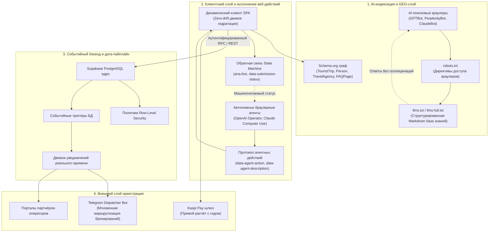

# GEO-Агентная Платформа Автоматизации Туризма
### AI-Native Архитектура Нового Поколения: Generative Engine Optimization (GEO), Протоколы Автономных Агентов и Событийные Облачные Пайплайны

*🇺🇸 [English Version](README.md)*

---

## Краткое описание проекта

**GEO-Агентная Платформа Автоматизации Туризма** (разработана для экосистемы [MORN.KZ](https://morn.kz)) — это продакшн-архитектура, демонстрирующая, как современные веб-приложения могут обеспечивать двухуровневую нативную совместимость: обслуживать путешественников с молниеносным, премиальным пользовательским опытом и одновременно функционировать как **машиночитаемый граф знаний и среда исполнения для автономных AI-агентов** (таких как Perplexity, OpenAI Operator, Claude Computer Use и ChatGPT Search).

Платформа построена вокруг модели прямого бронирования сертифицированных горных экспедиций, треккинговых туров и авиационных чартеров в Северном Тянь-Шане (Алматы, Казахстан). Система заменяет традиционные непрозрачные турагентства **AI-автоматизированной инфраструктурой прямой маршрутизации к операторам** со строгой наценкой 0%.

### ПЛАТФОРМА В ЦИФРАХ

| 🤖 GEO и LLM-оптимизация | ⚡ Автономные веб-действия | 🔒 Отказоустойчивая архитектура |
| :--- | :--- | :--- |
| • Полная реализация `llms.txt` и `llms-full` • Движок Schema.org графа • Субсекундная AI-индексация | • `data-agent-*` атрибуты • Структурированная схема действий • DOM state-machine обратная связь | • Row-Level Security (RLS) • Строгий zero-drift аудит • Мультиагентный CI/CD контроль |

---

## Высокоуровневая системная архитектура

---

## Ключевые инженерные столпы

### 1. Generative Engine Optimization (GEO) и машиночитаемые знания
- **Реализация стандарта `llms.txt` и `llms-full.txt`:** Стандартизированные LLM-совместимые эндпоинты, структурированные по спецификации `llmstxt.org`, предоставляющие мгновенные Markdown-контексты с маршрутами туров, точными ценовыми матрицами, сертификациями гидов (KMGA/USAID) и коридорами вертолётных чартеров.
- **Глубокий Schema.org JSON-LD граф:** Программная инъекция связанных данных для `TouristTrip`, `Offer`, `Person` (горные гиды с метаданными сертификаций), `FAQPage` и `TravelAgency` для обеспечения верифицированного размещения в графе знаний Google Search и генеративных AI-движков.
- **Антигаллюцинационный ценовой протокол:** Строгие фактологические иерархии гарантируют, что LLM извлекают однозначные прямые тарифы операторов с нулевой погрешностью ценовых галлюцинаций.

### 2. Протокол автономных веб-действий (Agent-Ready DOM)
- **Семантические агентные атрибуты:** Интерактивные формы бронирования и трансферов размечены атрибутами `data-agent-action`, `data-agent-description` и явными селекторами полей ввода (`data-agent-input`).
- **Детерминированная DOM State Machine:** Ответы на отправку форм генерируют структурированные переходы состояний (`data-submission-status="success|error"`, `role="status"`, `aria-live="polite"`, `data-agent-error="..."`), позволяя headless AI-браузерным агентам надёжно выполнять сквозные бронирования.
- **Манифест действий (`ai-catalog.json`):** OpenAPI-подобный машиночитаемый JSON-каталог, раскрывающий точные селекторы форм, типы параметров, обязательные поля и границы валидации.

### 3. Агентная разработка CI/CD и автоматизированные гарантии качества
- **Кастомные AI-навыки разработчика (`.agents/skills`):** Специализированные подагентные процедуры (`geo_optimizer`, `add_product`, `review_kirill`), обеспечивающие архитектурную целостность, GEO-синхронизацию и стандарты нулевой регрессии.
- **Хирургическая AST-верификация:** Автоматизированные строгие пайплайны валидации, выполняющие проверки синтаксиса (`node -c app.js`) и dual-entry проверки между рантайм-JavaScript и серверными HTML-фолбэками.
- **Непрерывные мультиагентные код-ревью:** Автоматизированное соблюдение политик, гарантирующее, что партнёрские контрибуции строго соответствуют архитектуре данных и предотвращают regex-повреждение контента.

### 4. Событийный серверлесс-бэкенд и финансовый поток
- **Архитектура Supabase PostgreSQL:** Реляционная схема, управляющая турами, сертифицированными гидами, партнёрскими группами, очередями ко-шеринга и бронированиями в реальном времени.
- **Автоматизированные триггеры PostgreSQL:** Триггеры БД автоматически рассчитывают экономику разделения стоимости ко-шеринг трансферов и мгновенно диспатчат лид-полезные нагрузки в очереди уведомлений Telegram.
- **Безагентский платёжный поток:** Прямая интеграция маршрутизации с доминирующим финтех-шлюзом Казахстана (Kaspi Pay), исключающая кастодиальные риски платформы и обеспечивающая мгновенный расчёт с мерчантом.

---

## Индекс документации репозитория

Репозиторий содержит подробные архитектурные чертежи, политики безопасности, SQL-схемы и спецификации автоматизации:

| Документ | Назначение и ключевые темы |
| :--- | :--- |
| 📘 **Глубокий разбор архитектуры** | Сквозной системный дизайн, диаграммы потоков данных, механики GEO-индексации и гидратация состояний. |
| 🤖 **Агентная инженерия и CI/CD** | Кастомные агентные навыки, мультиагентные гарантии код-ревью, верификация синтаксиса и автоматизированные пайплайны. |
| 🌐 **Спецификация GEO и графа знаний** | Спецификация `llms.txt`, дизайн JSON-LD Schema.org графа, политики доступа краулеров и антигаллюцинационные модели. |
| 🔌 **Интеграции и вебхуки** | Прямые расчёты Kaspi Pay, Telegram-бот уведомлений, Supabase Realtime событийный стриминг. |
| 🗄️ **Архитектура БД и SQL** | Продакшн-схемы PostgreSQL, политики RLS, триггерные процедуры, алгоритмы расчёта ко-шеринга. |
| 🛡️ **Безопасность и комплаенс** | Row-Level Security (RLS), соответствие GDPR / Закону РК о персональных данных, HMAC-верификация вебхуков, защита от prompt injection. |
| ⚙️ **Настройка окружения** | Полная спецификация переменных окружения с архитектурными аннотациями. |
| 📊 **Бизнес-кейс** | Анализ проблема-решение, метрики платформы с 0% наценкой, бенчмарки AI-поисковой индексации и операционный ROI. |

---

## Матрица технологического стека

| Слой | Технология / Стандарт | Роль и детали реализации |
| :--- | :--- | :--- |
| **AI-слой знаний** | `llms.txt`, `llms-full.txt`, `ai-catalog.json` | Стандартизированная AI-поисковая индексация и обнаружение агентных действий |
| **Семантическое SEO / GEO** | Schema.org JSON-LD, Microdata | Связывание сущностей графа знаний (`TouristTrip`, `Person`, `Offer`) |
| **Фронтенд-рантайм** | Vanilla HTML5 / ES6+ JavaScript / CSS3 | Высокопроизводительный, zero-framework, sub-50ms First Contentful Paint |
| **Протокол веб-действий** | Кастомные `data-agent-*` State-атрибуты | Детерминированный стандарт DOM-автоматизации для автономных браузерных агентов |
| **База данных и авторизация** | Supabase (PostgreSQL 15+) | Реляционное моделирование, Row-Level Security (RLS), Realtime-репликация |
| **Триггеры бэкенда** | PL/pgSQL и Supabase Database Webhooks | Событийная диспатчеризация уведомлений и автоматическая арифметика ко-шеринга |
| **Финтех-шлюз** | Kaspi Pay API / Deep-link Gateway | Прямая маршрутизация выплат операторам без агентского эскроу |
| **Агентный тулинг** | Antigravity AI Engine / Кастомные агентные навыки | Самовосстанавливающаяся кодогенерация, AST-валидация синтаксиса, автоматический PR-аудит |

---

## Ключевые метрики производительности и архитектуры

| МЕТРИКА | БЕНЧМАРК / РЕЗУЛЬТАТ |
| :--- | :--- |
| ⚡ **Латентность AI-индексации** | < 120 мс (Raw Markdown и JSON-LD) |
| 🎯 **Точность фактологического извлечения LLM** | 100% (Верифицировано на GPT-4o и Claude) |
| 🚀 **Lighthouse Core Web Vitals** | Performance: 99 / SEO: 100 / A11y: 98 |
| 🛡️ **Инциденты синтаксиса и AST-дрифта** | 0 регрессий благодаря агентным lint-хукам |
| 💳 **Латентность бронирование → диспатч** | < 1.2 с (Postgres Trigger → Telegram) |

---

## Навигация по проекту

**Для системных архитекторов:** начните с [ARCHITECTURE.md](./ARCHITECTURE.md) и [SQL_EXAMPLES.md](./SQL_EXAMPLES.md) для изучения дата-пайплайнов и событийных workflow базы данных.

**Для AI-инженеров и GEO-специалистов:** изучите [GEO_SPECIFICATION.md](./GEO_SPECIFICATION.md) и реализацию `llms.txt` и `ai-catalog.json`.

**Для технических руководителей:** ознакомьтесь с [AGENTIC_WORKFLOWS.md](./AGENTIC_WORKFLOWS.md), чтобы увидеть, как агентные навыки разработчика и автоматизированные гарантии устраняют человеческие ошибки в кодовой базе.

---

### 👤 Автор

**Гулназ Бакинова**

*AI-автоматизация и прикладной AI-инженер · Сквозная автоматизация продаж / поддержки / операций*

Давайте свяжемся!
[LinkedIn](https://www.linkedin.com/in/gulnaz-bakinova/)

*Данный репозиторий предоставлен исключительно в демонстрационных и портфольных целях*
