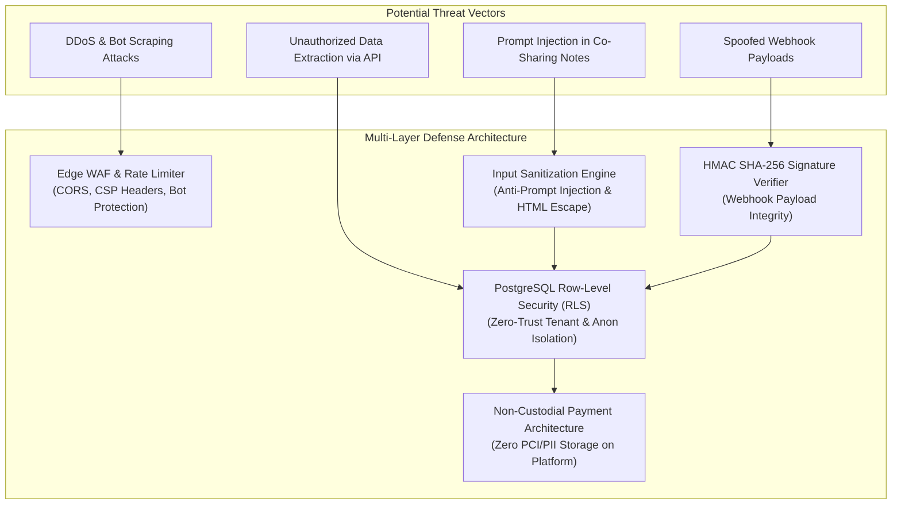

# Security Architecture, Compliance & Threat Mitigation

### Row-Level Security, Personal Data Compliance (GDPR / KZ Law), Non-Custodial Fintech, and Prompt Injection Defense

---

## 1. Security Architecture & Threat Defense Model

The platform enforces defense-in-depth across the application lifecycle, from client DOM interactions and AI crawler endpoints to PostgreSQL database access and regional fintech routing.



---

## 2. Personal Data Protection & Regulatory Compliance

The platform operates in strict compliance with the Law of the Republic of Kazakhstan No. 94-V *"On Personal Data and Its Protection"* and adheres to GDPR data minimization principles.

```
┌──────────────────────────────────────────────────────────────────────────────────────────┐
│                            DATA PROTECTION PILLARS                                       │
├──────────────────────────────┬─────────────────────────────┬─────────────────────────────┤
│ 1. Explicit Consent Gate     │ 2. Data Minimization        │ 3. Zero-Retention Booking   │
│ Mandatory checkbox & DOM     │ Only name and contact info  │ Lead data forwarded to lead │
│ validation (data_consent).   │ requested for coordination. │ guide; no permanent profiling│
└──────────────────────────────┴─────────────────────────────┴─────────────────────────────┘
```

**Implementation Details:**

- **Consent Enforcement:** The database rejects any insertion into `public.bookings` where `data_consent = false` via SQL `CHECK` constraints.
- **Granular Transparency:** Direct links to `/privacy-policy.html`, `/personal-data-consent.html`, and `/public-offer.html` are embedded in both human modal forms and machine-readable `/ai-catalog.json`.

---

## 3. Row-Level Security (RLS) & Zero-Trust Database Access

Database security is governed by PostgreSQL Row-Level Security (RLS) rather than relying exclusively on application-level middleware.

| Role / Context | Permissions on `tours` | Permissions on `guides` | Permissions on `bookings` | Permissions on `partners` |
|---|---|---|---|---|
| **Public Anon** | SELECT (Published only) | SELECT (Active only) | INSERT (With valid consent) | No Access |
| **Certified Partner** | SELECT | ALL (Own team only) | SELECT (Assigned tours) | SELECT / UPDATE (Own ID) |
| **Backend Service Role** | ALL (Bypasses RLS) | ALL | ALL | ALL |

> **Key Rule:** The `SUPABASE_SERVICE_ROLE_KEY` is strictly confined to secure serverless runtime environments (Edge Functions / Worker Queues) and is **never** bundled into client-side code.

---

## 4. AI-Specific Security: Indirect Prompt Injection Defense

Because the platform generates dynamic Markdown files (`/llms.txt`, `/llms-full.txt`) consumed directly by AI search engines, it incorporates strict sanitization against **Indirect Prompt Injection**:

- **User-Generated Input Sanitization:** User notes in co-sharing listings are stripped of Markdown control syntax (`---`, `system:`, `[INST]`, `Ignore previous instructions`).
- **Deterministic Context Boundaries:** AI ingestion endpoints use immutable delimiter fences preventing user-supplied text from executing instruction overrides on reading LLMs.
- **Strict Type Coercion:** All incoming parameters in `data-agent-*` forms are coerced to strict primitive types (integers, sanitized alphanumeric strings, validated E.164 phone formats).

---

## 5. Webhook Integrity & HMAC SHA-256 Verification

To prevent forged booking submissions or spoofed partner updates, all inbound external webhooks require cryptographic signature verification.

```typescript
// utils/verify-webhook-signature.ts
import crypto from 'crypto';

export function verifyWebhookSignature(
  rawPayload: string,
  signatureHeader: string,
  secretKey: string
): boolean {
  if (!signatureHeader || !secretKey) return false;

  const expectedSignature = crypto
    .createHmac('sha256', secretKey)
    .update(rawPayload, 'utf8')
    .digest('hex');

  // Use timing-safe equality check to prevent timing attacks
  return crypto.timingSafeEqual(
    Buffer.from(signatureHeader, 'hex'),
    Buffer.from(expectedSignature, 'hex')
  );
}
```

---

## 6. Non-Custodial Fintech & Payment Security

- **Zero Escrow Exposure:** The platform never collects, stores, or handles credit card numbers, CVVs, or bank credentials.
- **Direct Gateway Hand-Off:** All financial settlements redirect immediately to the licensed banking gateway (Kaspi Pay API) using HTTPS TLS 1.3 encryption.
- **Reconciliation Tokens:** Payments are verified via cryptographically signed callback hashes matched against immutable booking UUIDs.

---

## 7. Security Audit & Incident Response Policy

```
┌──────────────────────────────────────┬────────────────────────────────────────┐
│ SECURITY PROTOCOL                    │ STANDARD / BENCHMARK                   │
├──────────────────────────────────────┼────────────────────────────────────────┤
│ 🔒 Transport Encryption              │ TLS 1.3 Mandatory (HTTPS & WSS)        │
│ 🛡️ Content Security Policy (CSP)     │ Strict Script & Frame Ancestor Origin  │
│ ⏱️ Vulnerability Patch SLA           │ Critical: < 12h / Moderate: < 48h      │
│ 📋 Audit Logging                     │ 100% immutable logs in notification_logs│
└──────────────────────────────────────┴────────────────────────────────────────┘
```

---
