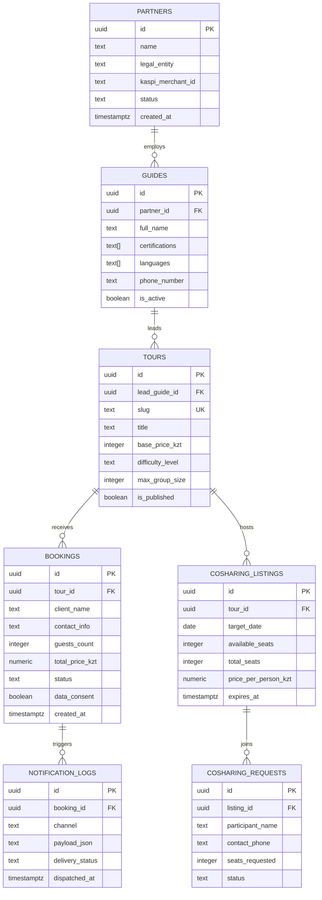

# Database Architecture & Production SQL Specifications

### PostgreSQL 15+ Schema Design, Row-Level Security (RLS) Policies, PL/pgSQL Triggers, and Real-Time Event Pipelines

---

## 1. Entity-Relationship Data Model (ERD)



---

## 2. Core DDL Table Definitions

```sql
-- Enable UUID and Cryptographic Extensions
CREATE EXTENSION IF NOT EXISTS "uuid-ossp";
CREATE EXTENSION IF NOT EXISTS "pgcrypto";

-- 1. Partners & Operator Teams
CREATE TABLE public.partners (
    id UUID PRIMARY KEY DEFAULT gen_random_uuid(),
    name TEXT NOT NULL,
    legal_name TEXT NOT NULL,
    kaspi_merchant_id TEXT,
    contact_email TEXT UNIQUE NOT NULL,
    phone_number TEXT NOT NULL,
    status TEXT NOT NULL DEFAULT 'active' CHECK (status IN ('active', 'suspended', 'pending')),
    created_at TIMESTAMPTZ NOT NULL DEFAULT NOW()
);

-- 2. Certified Mountain Guides
CREATE TABLE public.guides (
    id UUID PRIMARY KEY DEFAULT gen_random_uuid(),
    partner_id UUID REFERENCES public.partners(id) ON DELETE SET NULL,
    full_name TEXT NOT NULL,
    certifications TEXT[] NOT NULL DEFAULT '{}', -- e.g. ['KMGA', 'USAID', 'KTA']
    languages TEXT[] NOT NULL DEFAULT '{"ru"}',
    bio TEXT,
    avatar_url TEXT,
    phone_number TEXT NOT NULL,
    is_active BOOLEAN NOT NULL DEFAULT true,
    created_at TIMESTAMPTZ NOT NULL DEFAULT NOW()
);

-- 3. Direct Tour Catalog
CREATE TABLE public.tours (
    id UUID PRIMARY KEY DEFAULT gen_random_uuid(),
    lead_guide_id UUID REFERENCES public.guides(id) ON DELETE RESTRICT,
    slug TEXT UNIQUE NOT NULL,
    title TEXT NOT NULL,
    elevation_meters INTEGER,
    duration_days NUMERIC(3,1) NOT NULL DEFAULT 1.0,
    difficulty TEXT NOT NULL CHECK (difficulty IN ('Easy', 'Moderate', 'Challenging', 'Alpine Expedition')),
    base_price_kzt NUMERIC(12,2) NOT NULL CHECK (base_price_kzt >= 0),
    max_group_size INTEGER NOT NULL DEFAULT 10,
    is_published BOOLEAN NOT NULL DEFAULT true,
    created_at TIMESTAMPTZ NOT NULL DEFAULT NOW()
);

-- 4. Expedition Bookings (Direct Guide Routing)
CREATE TABLE public.bookings (
    id UUID PRIMARY KEY DEFAULT gen_random_uuid(),
    tour_id UUID NOT NULL REFERENCES public.tours(id) ON DELETE RESTRICT,
    client_name TEXT NOT NULL,
    contact_info TEXT NOT NULL,
    guests_count INTEGER NOT NULL DEFAULT 1 CHECK (guests_count > 0 AND guests_count <= 50),
    total_price_kzt NUMERIC(12,2) NOT NULL,
    booking_status TEXT NOT NULL DEFAULT 'pending' CHECK (booking_status IN ('pending', 'confirmed', 'completed', 'cancelled')),
    data_consent BOOLEAN NOT NULL DEFAULT false,
    source TEXT DEFAULT 'web_app',
    created_at TIMESTAMPTZ NOT NULL DEFAULT NOW()
);

-- 5. Co-Sharing Rides & Expedition Groups
CREATE TABLE public.cosharing_listings (
    id UUID PRIMARY KEY DEFAULT gen_random_uuid(),
    tour_id UUID NOT NULL REFERENCES public.tours(id) ON DELETE CASCADE,
    target_date DATE NOT NULL,
    total_seats INTEGER NOT NULL CHECK (total_seats > 0),
    available_seats INTEGER NOT NULL CHECK (available_seats >= 0),
    price_per_person_kzt NUMERIC(10,2) NOT NULL,
    organizer_contact TEXT NOT NULL,
    expires_at TIMESTAMPTZ NOT NULL,
    created_at TIMESTAMPTZ NOT NULL DEFAULT NOW()
);
```

---

## 3. Row-Level Security (RLS) Isolation Policies

```sql
-- Enable Row Level Security on all core tables
ALTER TABLE public.partners ENABLE ROW LEVEL SECURITY;
ALTER TABLE public.guides ENABLE ROW LEVEL SECURITY;
ALTER TABLE public.tours ENABLE ROW LEVEL SECURITY;
ALTER TABLE public.bookings ENABLE ROW LEVEL SECURITY;
ALTER TABLE public.cosharing_listings ENABLE ROW LEVEL SECURITY;

-- 1. Public Read Policies (SEO, AI Crawlers & Web Clients)
CREATE POLICY "Public can view published tours"
    ON public.tours FOR SELECT
    USING (is_published = true);

CREATE POLICY "Public can view active certified guides"
    ON public.guides FOR SELECT
    USING (is_active = true);

CREATE POLICY "Public can view active non-expired co-sharing listings"
    ON public.cosharing_listings FOR SELECT
    USING (expires_at > NOW() AND available_seats > 0);

-- 2. Public Anonymous Insertion Policy (Booking & Transfer Forms)
CREATE POLICY "Public anonymous users can submit booking requests"
    ON public.bookings FOR INSERT
    WITH CHECK (
        data_consent = true AND
        LENGTH(client_name) >= 2 AND
        LENGTH(contact_info) >= 5
    );

-- 3. Multi-Tenant Partner Isolation Policy
CREATE POLICY "Partners can only read and manage their own team guides"
    ON public.guides FOR ALL
    TO authenticated
    USING (partner_id = auth.uid())
    WITH CHECK (partner_id = auth.uid());
```

---

## 4. PL/pgSQL Event Triggers & Notification Pipelines

### Trigger: Automated Real-Time Telegram Dispatch on Booking Insert

```sql
-- Function to construct and emit notification payload
CREATE OR REPLACE FUNCTION public.handle_new_booking_notification()
RETURNS TRIGGER AS $$
DECLARE
    v_tour_title TEXT;
    v_guide_phone TEXT;
BEGIN
    -- Fetch tour title and assigned guide contact
    SELECT t.title, g.phone_number
    INTO v_tour_title, v_guide_phone
    FROM public.tours t
    LEFT JOIN public.guides g ON t.lead_guide_id = g.id
    WHERE t.id = NEW.tour_id;

    -- Insert log entry for audit and downstream dispatchers
    INSERT INTO public.notification_logs (
        booking_id,
        channel,
        payload_json,
        delivery_status,
        dispatched_at
    ) VALUES (
        NEW.id,
        'telegram_bot',
        jsonb_build_object(
            'booking_id', NEW.id,
            'tour_title', v_tour_title,
            'client_name', NEW.client_name,
            'contact_info', NEW.contact_info,
            'guests', NEW.guests_count,
            'total_price_kzt', NEW.total_price_kzt,
            'assigned_guide_phone', v_guide_phone
        )::text,
        'queued',
        NOW()
    );

    RETURN NEW;
END;
$$ LANGUAGE plpgsql SECURITY DEFINER;

-- Attach Trigger to public.bookings
CREATE TRIGGER on_new_booking_created
    AFTER INSERT ON public.bookings
    FOR EACH ROW
    EXECUTE FUNCTION public.handle_new_booking_notification();
```

### Trigger: Dynamic Co-Sharing Seat & Price Recalculation

```sql
-- Function to automatically adjust co-sharing economics upon participant join
CREATE OR REPLACE FUNCTION public.recalculate_cosharing_split()
RETURNS TRIGGER AS $$
DECLARE
    v_total_cost NUMERIC;
    v_current_participants INTEGER;
BEGIN
    -- Fetch base tour cost
    SELECT base_price_kzt INTO v_total_cost
    FROM public.tours
    WHERE id = (SELECT tour_id FROM public.cosharing_listings WHERE id = NEW.listing_id);

    -- Calculate remaining available seats
    UPDATE public.cosharing_listings
    SET
        available_seats = available_seats - NEW.seats_requested,
        -- Dynamically recompute split cost
        price_per_person_kzt = ROUND(v_total_cost / (total_seats - (available_seats - NEW.seats_requested)))
    WHERE id = NEW.listing_id;

    RETURN NEW;
END;
$$ LANGUAGE plpgsql SECURITY DEFINER;
```

---

## 5. Performance Indexing Strategy

```sql
-- Indexes for Sub-Millisecond GEO and API Queries
CREATE INDEX idx_tours_slug ON public.tours (slug) WHERE is_published = true;
CREATE INDEX idx_cosharing_expires ON public.cosharing_listings (expires_at) WHERE available_seats > 0;
CREATE INDEX idx_bookings_created ON public.bookings (created_at DESC);
CREATE INDEX idx_guides_partner ON public.guides (partner_id) WHERE is_active = true;
```

---
